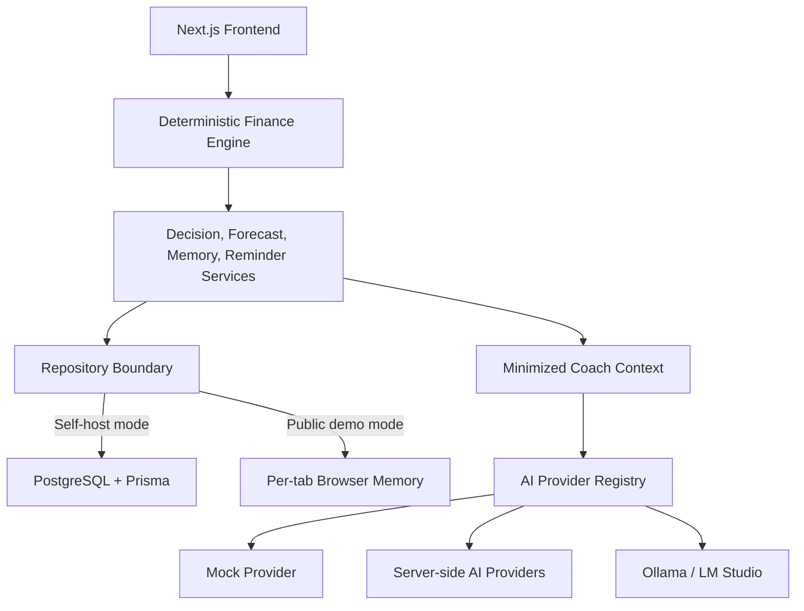

# Atlas AI

**Open-source AI Financial Intelligence Platform**

> Bring your own AI. Bring your own database. Deploy anywhere.

[](https://github.com/Tngc93/Atlas-AI/actions/workflows/ci.yml)
[](LICENSE)
[](docs/releases/v1.0.0-beta.md)
[](https://personal-atlas-ai.vercel.app)
[](https://nextjs.org/)

Atlas AI is a privacy-aware personal finance decision-support platform. It combines a deterministic finance engine with forecasts, scenario comparison, financial memory, reminders, and a contextual AI Coach.

The finance engine remains the source of truth. AI explains calculated results, but it does not calculate budgets, determine risk, or make decisions for the user.

> [!IMPORTANT]
> Atlas AI is educational software, not financial advice. The public demo uses fictional data and simulated Mock AI responses. Do not enter real financial information into a public demo deployment.

## Live Demo

**Production:** https://personal-atlas-ai.vercel.app  
**Demo workspace:** https://personal-atlas-ai.vercel.app/demo  
**AI Coach:** https://personal-atlas-ai.vercel.app/demo/coach

The public demo runs without PostgreSQL, paid infrastructure, or platform-owned AI keys. Demo state lives only in active-tab memory and resets on refresh or tab closure.

## Highlights

- Deterministic monthly cash-flow and protected-budget calculations
- Debt prioritization and 24-month payoff projections
- 3, 6, 12, and 24-month forecast views
- Decision Simulator for temporary income, expense, debt, and payment scenarios
- Financial Memory snapshots and trend intelligence
- Deterministic reminders and recommendation context
- Session-only conversational AI Coach with suggested questions, language selection, structured recommendations, and retry states
- Provider-independent AI architecture with structured output validation
- Self-host adapters for OpenAI, Gemini, Anthropic, OpenRouter, Ollama, LM Studio, and OpenAI-compatible APIs
- Database-free public demo with fictional data and Mock AI
- Secret scanning, unit tests, PostgreSQL integration tests, and Playwright E2E coverage

## Product Tour

| Surface | Public route |
| --- | --- |
| Landing | [Open](https://personal-atlas-ai.vercel.app) |
| Demo Dashboard | [Open](https://personal-atlas-ai.vercel.app/demo) |
| AI Coach | [Open](https://personal-atlas-ai.vercel.app/demo/coach) |
| Forecast | [Open](https://personal-atlas-ai.vercel.app/demo/forecast) |
| Decision Simulator | [Open](https://personal-atlas-ai.vercel.app/demo/decisions) |
| Financial Memory | [Open](https://personal-atlas-ai.vercel.app/demo/memory) |
| Architecture | [Open](https://personal-atlas-ai.vercel.app/architecture) |
| Documentation | [Open](https://personal-atlas-ai.vercel.app/docs) |

Release-quality screenshots and a short product walkthrough will be added as launch media without blocking access to the live product.

## AI Coach

The AI Coach is an explanatory layer on top of the deterministic finance engine.

Public demo behavior:

- Browser-only Mock AI
- No external AI request
- No API key required
- English by default, with Turkish response support
- Session-only conversation history
- Structured responses with summary, recommendation, risk, next action, and key numbers

Self-host behavior:

- Uses the configured server-side provider registry
- Keeps provider credentials out of the browser
- Rebuilds minimized financial context on the server
- Sends only the minimum fields required for explanation

AI explanations do not change calculations produced by the finance engine.

## Architecture



More detail: [Architecture](docs/ARCHITECTURE.md), [AI Architecture](docs/product/AI_ARCHITECTURE.md), and [Product Architecture](docs/product/PRODUCT_ARCHITECTURE.md).

## Technology Stack

| Area | Technology |
| --- | --- |
| Web | Next.js App Router, React, TypeScript |
| UI | Tailwind CSS, Recharts, Lucide |
| Data | Prisma ORM, PostgreSQL |
| Validation | Zod |
| AI | Provider registry, minimized context, structured responses, Mock fallback |
| Testing | Vitest, Playwright |
| CI | GitHub Actions |
| Hosting | Vercel public demo; self-host supported |

## Quick Start

Requirements: Node.js 20+, npm, and PostgreSQL for normal self-host mode.

```bash
git clone https://github.com/Tngc93/Atlas-AI.git
cd Atlas-AI
npm ci
cp .env.example .env.local
npm run prisma:generate
npm run dev
```

Open `http://localhost:3000`.

## Public Demo Mode

```bash
PUBLIC_DEMO_MODE=true AI_PROVIDER=mock npm run dev
```

Public demo mode:

- Uses an immutable fictional seed and active-tab memory
- Supports temporary income, debt, and expense CRUD
- Keeps every demo product link under `/demo/*`
- Resets after refresh, tab closure, browser-context change, or confirmed reset
- Does not write finance state to PostgreSQL, cookies, localStorage, sessionStorage, IndexedDB, Cache Storage, or service-worker storage
- Blocks DB-backed API routes and Prisma initialization
- Uses deterministic Mock AI with zero required API cost

For a free public deployment, set only:

```text
PUBLIC_DEMO_MODE=true
AI_PROVIDER=mock
NEXT_PUBLIC_SITE_URL=https://your-final-origin.example
```

Do not add `DATABASE_URL`, `DIRECT_URL`, or owner-owned cloud AI credentials to the public demo deployment.

## Self-host Installation

1. Provision a PostgreSQL database.
2. Set pooled `DATABASE_URL` and direct `DIRECT_URL` values in `.env.local`.
3. Keep `AI_PROVIDER=mock`, or configure a supported server-side provider.
4. Generate Prisma Client and apply reviewed PostgreSQL migrations.
5. Run validation before exposing the application.

```bash
npm run security:secrets
npx prisma validate
npm run prisma:generate
npm run lint
npm run test
npm run build
```

Authentication and user ownership are not implemented. Do not expose database mode as a public multi-user financial service with real financial data. See [Self-hosting](docs/SELF_HOSTING.md) and [Production Readiness](docs/operations/production-readiness.md).

## Supported AI Providers

| Provider | Self-host status | Public demo status |
| --- | --- | --- |
| Mock | Implemented | Default and only public provider |
| Gemini | Implemented | Disabled in public production |
| OpenAI | Implemented adapter | Self-host only |
| Anthropic | Implemented adapter | Self-host only |
| OpenRouter | Implemented adapter | Disabled in public production |
| Ollama | Local/self-host | Requires local runtime and CORS configuration |
| LM Studio | Local/self-host | Requires local runtime and CORS configuration |
| Custom OpenAI-compatible | Self-host | Remote endpoints remain server-side |

Credentials remain in server-side environment variables. No frontend API-key input is exposed.

## Security and Privacy

- Never commit `.env`, API keys, database URLs, database files, or real financial fixtures.
- AI receives minimized deterministic context rather than raw banking records.
- Browser cloud providers fail closed in production.
- Demo mode does not persist finance state or initialize Prisma.
- Secret scanning is part of the quality gate.
- Public demo responses are explicitly identified as simulated Mock AI output.

Read [SECURITY.md](SECURITY.md) before reporting a vulnerability. Do not place secrets or real financial data in public issues.

## Project Structure

```text
src/app/                 Next.js routes and API handlers
src/components/          UI components
src/features/finance/    Deterministic finance engine
src/features/forecast/   Forecast and scenario logic
src/features/decision/   Decision simulation and trade-offs
src/features/memory/     Financial Memory and trends
src/features/reminders/  Deterministic reminder engine
src/features/coach/      Coach context and AI providers
src/features/demo/       Session-isolated public demo state
src/lib/db/              Prisma boundary
prisma/                  PostgreSQL schema and migrations
e2e/                     PostgreSQL-backed E2E tests
e2e-demo/                Database-free demo E2E tests
docs/                    Product and engineering documentation
```

## Testing

```bash
npm run security:secrets
npm run security:audit
npx prisma generate
npm run lint
npm run test:unit
npm run test:integration
npm run build
npm run test:e2e
npm run build:demo
npm run test:e2e:demo
```

PostgreSQL integration and standard E2E tests require guarded `test-preview` variables documented in [Production Readiness](docs/operations/production-readiness.md). Demo tests require no database or paid AI key.

## Current Release Status

`v1.0.0-beta` is suitable for public portfolio demonstration and open-source review with these boundaries:

- Public demo uses fictional data and Mock AI
- Self-host mode is not public multi-user ready
- Authentication, user ownership, and banking integrations are not included
- Financial outputs are educational decision support, not financial advice

See [release notes](docs/releases/v1.0.0-beta.md), [release checklist](docs/releases/RELEASE_CHECKLIST.md), and [changelog](CHANGELOG.md).

## Roadmap

### Implemented

- Deterministic finance engine and debt planning
- Forecast, scenario comparison, Decision Intelligence, Financial Memory, and reminders
- Contextual session-only AI Coach
- Provider-independent AI adapters and Mock fallback
- PostgreSQL test-preview infrastructure
- Zero-cost, session-isolated demo mode
- Vercel production deployment with canonical metadata

### Planned

- Authentication, user ownership, and multi-user isolation
- Banking data import with explicit consent
- Persistent conversation history and multiple threads
- PWA and mobile experience
- Plugin/extension SDK
- Operational monitoring and accessibility score automation

See [Roadmap](docs/ROADMAP.md).

## Contributing

Contributions are welcome. Start with [CONTRIBUTING.md](CONTRIBUTING.md), follow the [Code of Conduct](CODE_OF_CONDUCT.md), and use the issue and pull request templates. Security vulnerabilities must follow [SECURITY.md](SECURITY.md), not a public bug report.

## License

MIT License. See [LICENSE](LICENSE).

## Product Philosophy

Atlas AI is governed by the accepted [Product Manifesto](docs/product/PRODUCT_MANIFESTO.md). A concise engineering rationale is available in [Product Philosophy](docs/PRODUCT_PHILOSOPHY.md).

## Acknowledgements

Atlas AI builds on the open-source ecosystems around Next.js, React, TypeScript, Prisma, PostgreSQL, Vitest, Playwright, Recharts, and supported AI provider APIs and local model runtimes.