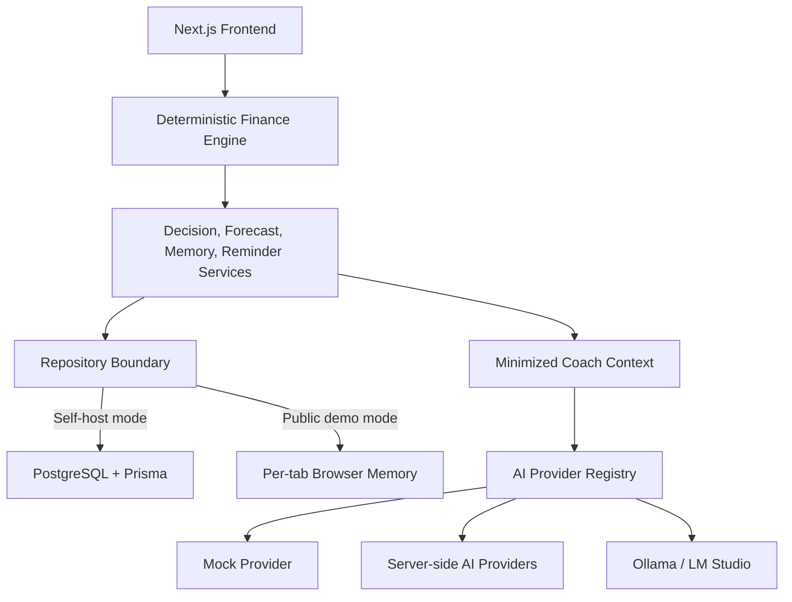
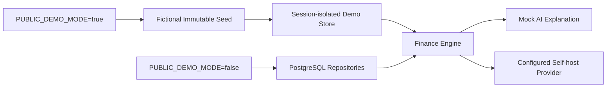

# Atlas AI

**Open-source AI Financial Intelligence Platform**

> Bring your own AI. Bring your own Database. Deploy anywhere.

[](#testing)
[](LICENSE)
[](#roadmap)
[](https://nextjs.org/)

Atlas AI is a privacy-aware personal finance decision-support platform. It combines a deterministic finance engine with forecasts, scenario comparison, financial memory, reminders, and provider-independent AI explanations.

The finance engine remains the source of truth. AI may explain calculated results, but it does not calculate budgets, determine risk, or make decisions for the user.

> [!IMPORTANT]
> Atlas AI is educational software, not financial advice. The public demo uses fictional data and Mock AI. Do not enter real financial information into a public demo deployment.

## Key Features

- Deterministic monthly cash-flow and living-budget calculations
- Debt prioritization and payoff projections
- 3, 6, 12, and 24-month forecast views
- Temporary decision and forecast scenario comparison
- Financial Memory snapshots and trend intelligence
- Deterministic recommendation and reminder engines
- Provider-independent AI architecture with structured output validation
- Mock-first graceful fallback when AI is unavailable
- Self-host adapters for OpenAI, Gemini, Anthropic, OpenRouter, Ollama, LM Studio, and OpenAI-compatible APIs
- Session-isolated, zero-cost public demo mode without database persistence
- Secret scanning, unit, PostgreSQL integration, and Playwright E2E coverage

## Architecture Overview





More detail: [Architecture](docs/ARCHITECTURE.md), [AI Architecture](docs/product/AI_ARCHITECTURE.md), and [Product Architecture](docs/product/PRODUCT_ARCHITECTURE.md).

## Technology Stack

| Area | Technology |
| --- | --- |
| Web | Next.js App Router, React, TypeScript |
| UI | Tailwind CSS, Recharts, Lucide |
| Data | Prisma ORM, PostgreSQL |
| Validation | Zod |
| AI | Provider registry, structured responses, Mock fallback |
| Testing | Vitest, Playwright |
| CI | GitHub Actions |

## Screenshots

Screenshots will be added before the public launch. These placeholders intentionally avoid presenting unreleased visuals as final.

| Surface | Preview |
| --- | --- |
| Dashboard | _Screenshot placeholder — Dashboard_ |
| Forecast | _Screenshot placeholder — Forecast_ |
| Decision Simulator | _Screenshot placeholder — Decision Simulator_ |
| Financial Memory | _Screenshot placeholder — Financial Memory_ |
| AI Coach | _Screenshot placeholder — AI Coach_ |
| Provider Settings | _Screenshot placeholder — Provider Settings_ |
| Demo Mode | _Screenshot placeholder — Zero-Cost Demo_ |

## Live Demo

> **Status: placeholder.** A public URL has not been published from this repository yet.

The planned public demo runs with fictional data, per-tab memory state, and Mock AI. It does not require `DATABASE_URL`, paid provider keys, authentication, or shared database mutation.

## Quick Start

Requirements: Node.js 20+, npm, and PostgreSQL for normal self-host mode.

```bash
git clone https://github.com/Tngc93/personal-finance-coach-dashboard.git
cd personal-finance-coach-dashboard
npm ci
cp .env.example .env.local
npm run prisma:generate
npm run dev
```

Open `http://localhost:3000`.

## Self-host Installation

1. Provision a PostgreSQL database.
2. Set pooled `DATABASE_URL` and direct `DIRECT_URL` values in `.env.local`.
3. Keep `AI_PROVIDER=mock`, or configure a supported server-side provider.
4. Generate Prisma Client and apply only reviewed PostgreSQL migrations.
5. Run validation before exposing the application.

```bash
npm run security:secrets
npx prisma validate
npm run prisma:generate
npm run lint
npm run test
npm run build
```

Authentication and user ownership are not implemented. Do not expose database mode as a multi-user public service with real financial data. See [Self-hosting](docs/SELF_HOSTING.md) and [Production Readiness](docs/operations/production-readiness.md).

## Bring Your Own AI

The default provider is `mock`, which makes no paid external AI call.

| Provider | Server self-host | Browser/public status |
| --- | --- | --- |
| Mock | Implemented | Default demo provider |
| Gemini | Implemented | Experimental browser mode disabled in production |
| OpenAI | Implemented adapter | Self-host only |
| Anthropic | Implemented adapter | Self-host only |
| OpenRouter | Implemented adapter | Experimental browser mode disabled in production |
| Ollama | Implemented adapter | Local-only; requires CORS configuration |
| LM Studio | Implemented adapter | Local-only; requires CORS configuration |
| Custom OpenAI-compatible | Implemented adapter | Self-host only for remote endpoints |

Credentials remain in server-side environment variables for self-host mode. Browser credentials, where explicitly enabled for local development, are session-only and must never enter repository or database storage.

## Bring Your Own Database

Atlas AI uses Prisma and PostgreSQL in self-host mode. Runtime requests use `DATABASE_URL`; Prisma migration operations use `DIRECT_URL`.

- Archived SQLite migrations must not be applied to PostgreSQL.
- Public demo mode never runs production migrations.
- Public demo deployments must not receive database credentials.
- Multi-user production use requires planned Auth and user ownership work.

## Demo Mode

```bash
PUBLIC_DEMO_MODE=true AI_PROVIDER=mock npm run dev
```

- Uses an immutable fictional seed and active-tab memory
- Supports temporary income, debt, and expense CRUD
- Resets after refresh, tab closure, or `Demo verisini sıfırla`
- Does not write finance state to database, URL, cookies, `localStorage`, or `sessionStorage`
- Blocks DB-backed API routes and Prisma initialization
- Uses Mock AI with zero required API cost

```bash
npm run build:demo
npm run test:e2e:demo
```

## Security

- Never commit `.env`, API keys, database URLs, database files, or real financial fixtures.
- AI receives minimized deterministic context rather than raw banking activity.
- Browser BYOK is disabled by default; cloud browser providers remain fail-closed in production.
- Demo mode does not persist finance state or initialize Prisma.
- Secret scanning is part of the quality gate.

Read [SECURITY.md](SECURITY.md) before reporting a vulnerability. Do not place secrets or real financial data in public issues.

## Project Structure

```text
src/app/                 Next.js routes and API handlers
src/components/          UI components
src/features/finance/    Deterministic finance engine
src/features/forecast/   Forecast and scenario logic
src/features/decision/   Decision simulation and trade-offs
src/features/memory/     Financial Memory and trends
src/features/reminders/  Deterministic reminder engine
src/features/coach/      Coach context and AI providers
src/features/demo/       Session-isolated public demo state
src/lib/db/              Prisma boundary
prisma/                  PostgreSQL schema and migrations
e2e/                     PostgreSQL-backed E2E tests
e2e-demo/                Database-free demo E2E tests
docs/                    Product and engineering documentation
```

## Testing

```bash
npm run security:secrets
npm run security:audit
npx prisma generate
npm run lint
npm run test:unit
npm run test:integration
npm run build
npm run test:e2e
npm run build:demo
npm run test:e2e:demo
```

PostgreSQL integration and standard E2E tests require guarded `test-preview` variables documented in [Production Readiness](docs/operations/production-readiness.md). Demo tests require no database or paid AI key.

## Roadmap

### Implemented

- Deterministic finance engine and debt planning
- Forecast, scenario comparison, Decision Intelligence, Financial Memory, reminders, and trend/recommendation context
- Provider-independent AI adapters and Mock fallback
- PostgreSQL test-preview infrastructure
- Zero-cost, session-isolated demo mode

### Experimental

- Browser BYOK capability gates
- Local Ollama and LM Studio browser connectivity
- PostgreSQL production migration workflow

### Planned

- Authentication, user ownership, and multi-user isolation
- Banking data import with explicit consent
- PWA and mobile experience
- Plugin/extension SDK
- Production deployment and operational monitoring

See [Roadmap](docs/ROADMAP.md).

## Contributing

Contributions are welcome. Start with [CONTRIBUTING.md](CONTRIBUTING.md), follow the [Code of Conduct](CODE_OF_CONDUCT.md), and use the issue and pull request templates. Security vulnerabilities must follow [SECURITY.md](SECURITY.md), not a public bug report.

## License

MIT License. See [LICENSE](LICENSE).

## Product Philosophy

Atlas AI is governed by the accepted [Product Manifesto](docs/product/PRODUCT_MANIFESTO.md). A concise engineering rationale is available in [Product Philosophy](docs/PRODUCT_PHILOSOPHY.md).

## Acknowledgements

Atlas AI builds on the open-source ecosystems around Next.js, React, TypeScript, Prisma, PostgreSQL, Vitest, Playwright, Recharts, and supported AI provider APIs and local model runtimes.

## FAQ

### Is Atlas AI a financial advisor?

No. It is educational decision-support software. Calculations and AI explanations are not financial advice.

### Does AI calculate my budget or risk level?

No. Those values come from deterministic code. AI is downstream and explanatory only.

### Can I use Atlas AI without an AI API key?

Yes. Mock mode requires no key and keeps all deterministic features available.

### Does the public demo store my changes?

No. Demo changes live only in active-tab memory and reset on refresh or tab closure.

### Is the project ready for public multi-user financial data?

No. Authentication and user ownership remain planned requirements.

### Can I use my own AI and database?

Yes in self-host mode. Configure your own PostgreSQL connection and supported server-side provider through environment variables.
