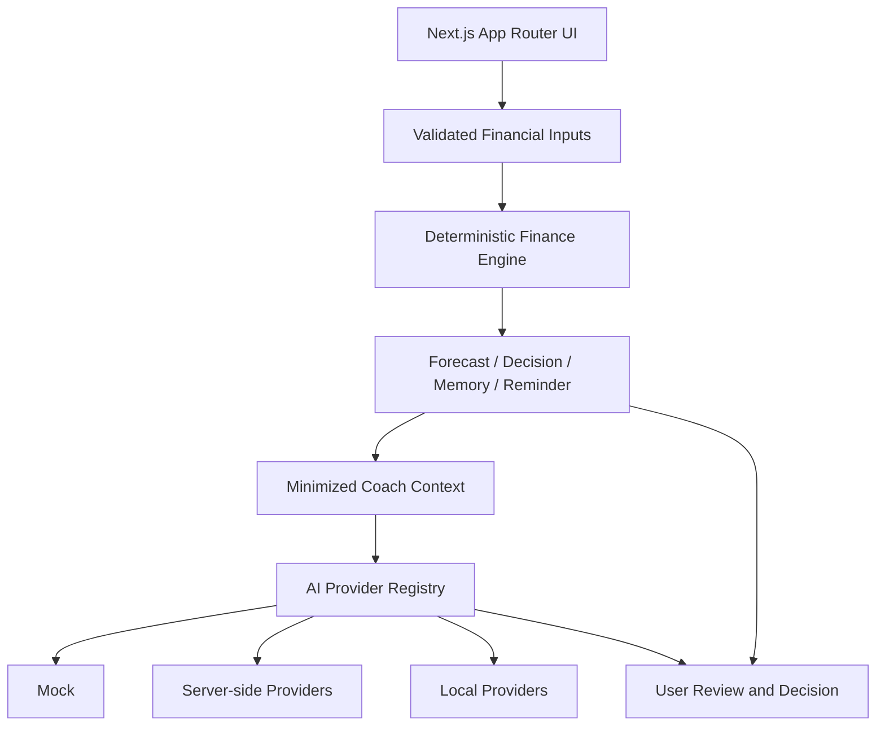
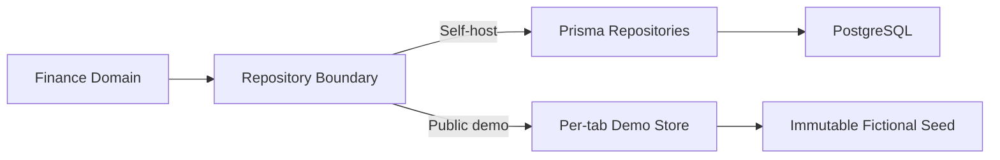

# Atlas AI Architecture

## Overview

Atlas AI separates financial truth, persistence, scenarios, and AI explanation. Higher layers may interpret deterministic outputs but cannot replace them.

## Layers

### Presentation

Next.js pages and React components display current reality, evidence, scenarios, forecasts, reminders, memory, and AI explanations. UI copy distinguishes calculated facts, assumptions, temporary scenarios, and user decisions.

### Deterministic Finance

The finance engine calculates monthly allocation, living budget, risk, payment priority, and payoff projections. It is independent from AI providers and persistence implementations.

### Decision Services

Forecast, scenario, decision, memory, trend, recommendation, and reminder services derive structured outputs from finance snapshots. Temporary scenarios do not mutate saved state.

### Repository Boundary

Self-host mode uses Prisma repositories backed by PostgreSQL. Domain services consume mapped finance types rather than Prisma records.

### AI Explanation

Coach Context Builder minimizes deterministic plan, memory, trend, and recommendation signals. Provider adapters normalize timeout, retry, errors, and structured responses. Invalid or unavailable providers fall back to Mock where configured.

## Execution Modes

### Public Demo

- Enabled explicitly with `PUBLIC_DEMO_MODE=true`
- Uses fictional seed data and active-tab memory
- Does not initialize Prisma or call DB-backed APIs
- Uses Mock AI and requires no paid provider key
- Resets after refresh, tab closure, or manual reset
- Keeps the marketing website at `/` and the canonical demo entry at `/demo`
- Keeps demo navigation under `/demo/*`; unknown demo routes fail closed
- Stores no demo financial state in browser persistence or URLs

### PostgreSQL Self-host

- Default execution mode
- Requires `DATABASE_URL`; migrations use `DIRECT_URL`
- Uses server-side repositories and provider configuration
- Must not silently fall back to demo mode
- Is not ready for public multi-user use until Auth and user ownership are implemented

## Provider Abstraction

Provider metadata describes execution mode, authentication, model, base URL capability, and availability. Credentials remain outside Coach Context and domain models. OpenAI, Anthropic, and remote custom endpoints are self-host-only; Ollama and LM Studio are local-only; cloud browser BYOK remains experimental and production-disabled.

## Testing Strategy

- Unit tests cover deterministic calculations and pure services.
- PostgreSQL integration tests use guarded, isolated test schemas.
- Standard Playwright tests verify DB-backed flows.
- Demo Playwright tests run without database credentials and verify reset, storage avoidance, and visitor isolation.
- Secret scanning and dependency audit are CI quality gates.

## Deployment Philosophy

Deployment is environment-explicit:

- Public demo: no database secret, no paid AI key, fictional data only.
- Self-host: operator-owned PostgreSQL and optional provider credentials.
- Public multi-user production: planned only after Auth, ownership checks, migration validation, and recovery procedures.

The repository does not assume one required hosting, database, or AI vendor.
